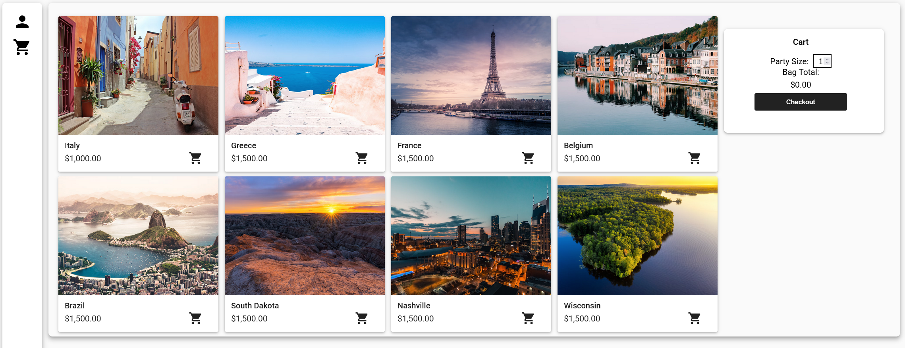
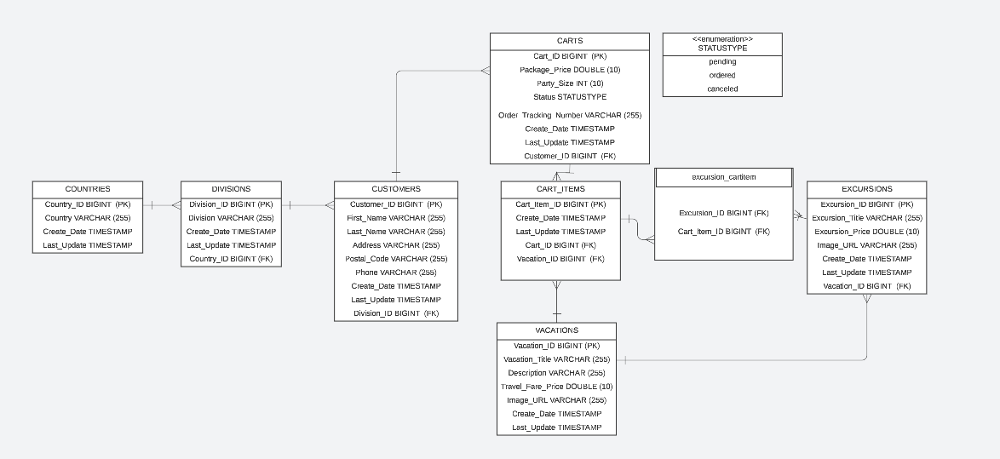
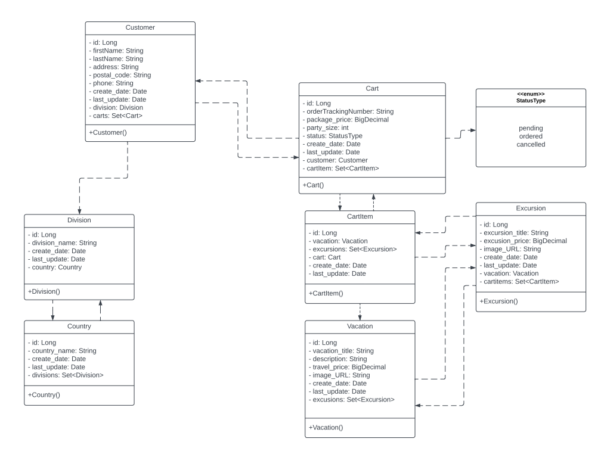

# Vacation Cart Manager

Vacation Cart Manager is a web application crafted to streamline the organization of vacation plans and excursion bookings. Featuring a shopping cart system, it aids in the efficient management of travel plans and purchases, catering to both individual travelers and groups, aiming to ease the logistical challenges of travel planning.

## Table of Contents

- [Languages Used](#languages-used)
- [Technologies Used](#technologies-used)
- [Features](#features)
- [Installation](#installation)
- [Usage](#usage)
- [License](#license)
- [About](#about)

## Languages Used

- Java
- SQL

## Technologies Used

- Spring Boot
- JPA/Hibernate
- Maven

## Features

- Vacation planning and booking with an intuitive interface.
- Selection and management of excursions from a varied catalog.
- Shopping cart features to streamline bookings and purchases.

## Installation

### Setup Database

- The script 'resets' the database state in 3 steps:
  - Drops the database and recreates it.
  - Inserts a demo customer and cart, and all other data.
  - Creates a user `ecommerceapp` and grants permissions as needed.
- **Always run it after testing to ensure a clean slate.**
- **Don't open the file directly.** Instead, follow these steps:
  1. Open a MySQL editor (MySQL Workbench).
  2. Click on the 'Local instance MySQL80` connection.
  3. Go to File > Open SQL Script
  4. The script is located at `create_and_populate_db.sql`
  5. Click the lightning bolt to execute the script.

### Start Vacation Cart Manager

1. Clone the repository to your local system.
2. Ensure Java (version 11 or newer) and Maven are installed.
3. Build the ui in `src/main/resources/UI` with `npm install`, then `ng build` and `ng serve`.
4. Set up Maven and Java according to your system specifications.
5. Run `mvnw spring-boot:run` in the project's root directory to start the application.

## Usage

How to navigate Vacation Cart Manager:

1. Access the front end at `http://localhost:4200`.
2. Access the application at `http://localhost:8080` after starting it.
3. Explore the homepage for links to vacation planning, excursion selection, and shopping cart management.
4. Use the 'Excursions' section to browse and book trips.
5. Manage your selections in the shopping cart, where you can modify quantities or remove items.
6. Finalize your travel plans through the checkout feature.

Visual guides for these processes can be found in the `images` directory.

## About

### Vacation ERD

### Vacation UML

## License

[MIT License](LICENSE)
